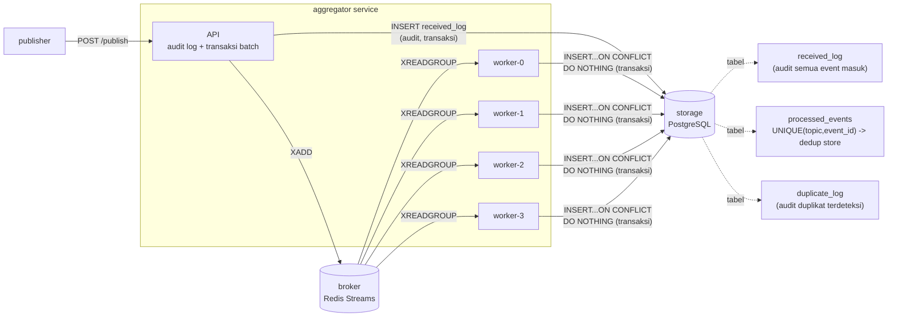

# Pub-Sub Log Aggregator Terdistribusi
 
Sistem pub-sub log aggregator multi-service dengan idempotent consumer,
deduplication persisten, dan transaksi/kontrol konkurensi. Dibangun dengan
Python (FastAPI + asyncio), Postgres, dan Redis Streams, dijalankan via
Docker Compose.
 
## Arsitektur
 

 
**Kenapa desain ini:**
- `aggregator` memisahkan dua tanggung jawab: (1) API path yang menerima &
  mencatat audit (`received_log`) secara cepat dan atomik per-batch, dan
  (2) worker konsumen yang memproses dedup secara asinkron dari broker.
  Ini memberi *backpressure isolation*: lonjakan publish tidak langsung
  membanjiri transaksi dedup.
- `broker` (Redis Streams + consumer group) memberi *at-least-once delivery*
  dan memungkinkan beberapa worker konsumen berjalan paralel dengan
  pembagian kerja otomatis oleh Redis (`XREADGROUP`).
- Idempotency final dijamin di `storage` lewat `UNIQUE (topic, event_id)`
  + `INSERT ... ON CONFLICT DO NOTHING`, bukan oleh aplikasi. Ini penting:
  meski Redis pernah mengirim ulang pesan yang sama (at-least-once, bukan
  exactly-once), Postgres yang menjadi sumber kebenaran akhir.
## Build & Run
 
```bash
docker compose up --build
```
 
Aggregator dapat diakses di `http://localhost:8080` secara default. Hanya
port aggregator yang dipublikasikan ke host; `storage` dan `broker` hanya
bisa diakses lewat jaringan internal Compose (`internal` network).
 
> **Catatan penting soal `publisher`:** service ini bersifat *one-shot job*
> (generate beban lalu keluar), bukan service yang harus selalu hidup.
> `docker compose up -d` akan **menjalankan ulang** publisher setiap kali
> dipanggil (karena container sebelumnya sudah *exited*). Untuk
> menyalakan ulang container yang sudah ada tanpa memicu beban baru,
> gunakan `docker compose start` (bukan `up -d`). Gunakan
> `docker compose run --rm publisher` hanya saat memang sengaja ingin
> menjalankan beban uji lagi.
 
Menjalankan beban uji (>=20.000 event, >=30% duplikasi) secara sengaja:
 
```bash
docker compose run --rm publisher
```
 
Konfigurasi publisher lewat env var (lihat `docker-compose.yml`):
`NUM_EVENTS`, `DUPLICATE_RATE`, `BATCH_SIZE`, `CONCURRENCY`, `TOPICS`.
 
Alternatif beban uji dengan k6 (lihat `scripts/k6/load_test.js`):
 
```bash
k6 run --vus 20 --duration 60s scripts/k6/load_test.js
```
 
## Endpoints
 
| Method | Path        | Keterangan                                              |
|--------|-------------|----------------------------------------------------------|
| POST   | `/publish`  | Terima 1 event atau batch (array) event. Validasi skema atomik per-batch. Mengembalikan `202` + jumlah diterima. |
| GET    | `/events`   | `?topic=...&limit=...` daftar event unik yang **sudah selesai diproses** (bukan sekadar diterima). |
| GET    | `/stats`    | `received`, `unique_processed`, `duplicate_dropped`, `topics`, `uptime_seconds`. |
| GET    | `/health`   | Liveness/readiness check (DB + Redis ping).               |
 
Contoh event JSON:
```json
{
  "topic": "auth",
  "event_id": "evt-001",
  "timestamp": "2026-06-19T10:00:00Z",
  "source": "publisher-sim",
  "payload": { "user_id": 42 }
}
```
 
## Persistensi
 
- `storage_pg_data` (named volume) -> data Postgres, termasuk seluruh
  tabel dedup (`processed_events`), audit (`received_log`,
  `duplicate_log`). Bertahan walau container `storage`/`aggregator`
  dihapus & dibuat ulang (`docker compose rm` lalu `docker compose up`).
- `broker_data` (named volume) -> Redis AOF persistence, untuk pesan
  stream yang belum sempat diproses saat restart.
- `aggregator_data` -> dicadangkan untuk file-based store opsional
  (tidak dipakai pada konfigurasi default karena kami memakai Postgres).
Bukti: lihat `report.md` Bagian II §5 (Bukti Persistensi) dan video demo
(hapus container, data tetap ada).
 
## Idempotency & Dedup
 
Kunci dedup adalah **(topic, event_id)**, bukan `event_id` saja — dua
topik berbeda dengan `event_id` sama dianggap dua event berbeda secara
sengaja (sesuai semantik pub-sub multi-topik).
 
## Transaksi & Konkurensi
 
- Isolation level: **READ COMMITTED** (default Postgres). Lihat `report.md`
  Bagian I, T8 untuk alasan kenapa ini cukup (constraint UNIQUE + `ON
  CONFLICT DO NOTHING` sudah atomik di level storage engine, sehingga
  SERIALIZABLE tidak diperlukan).
- Dibuktikan oleh `tests/test_aggregator.py::test_concurrent_publish_of_same_event_id_no_double_process`
  yang mengirim 20 request paralel dengan `event_id` sama dan memverifikasi
  hanya 1 yang berhasil diproses.
## Menjalankan Test
 
```bash
docker compose up -d --build
pip install -r tests/requirements.txt
cd tests
set BASE_URL=http://localhost:8082   
pytest -v
```
 
> `BASE_URL` default ke `http://localhost:8082` (lihat `tests/conftest.py`).
> Kalau kamu mengubah port host aggregator, set env var ini (berlaku hanya
> untuk sesi terminal yang aktif) atau ubah default-nya langsung di
> `tests/conftest.py` agar tidak perlu di-set ulang setiap sesi baru.
 
17 test (lihat daftar lengkap di `tests/test_aggregator.py`), mencakup:
validasi skema, dedup single & batch, dedup lintas-batch, dedup berbeda
topik, konkurensi/race condition, persistensi setelah restart container,
konsistensi `/stats`, dan stress kecil.
 
> Test persistensi (`test_persistence_after_aggregator_restart`) menjalankan
> `docker compose restart aggregator` lewat `subprocess` — jalankan pytest
> dari host yang punya akses Docker CLI ke compose project yang sama.
 
## Asumsi & Batasan
 
- Total ordering antar-event **tidak** dijamin (lihat `report.md` Bagian I,
  T5): pub-sub ini didesain untuk idempotent dedup, bukan strict ordering.
  Setiap event diberi `timestamp` oleh publisher untuk pengurutan logis
  di sisi pembaca bila diperlukan.
- `/publish` bersifat *batch-atomic* untuk tahap validasi & audit-log
  (`received_log`); kebijakan ini didokumentasikan di `report.md` Bagian I, T8.
- Network Compose tidak diset `internal: true` secara penuh agar host
  (untuk demo & test) dapat menjangkau `aggregator:8080`; tidak ada
  dependensi ke layanan publik eksternal mana pun saat runtime.
## Video Demo
 
[ISI LINK YOUTUBE DI SINI]