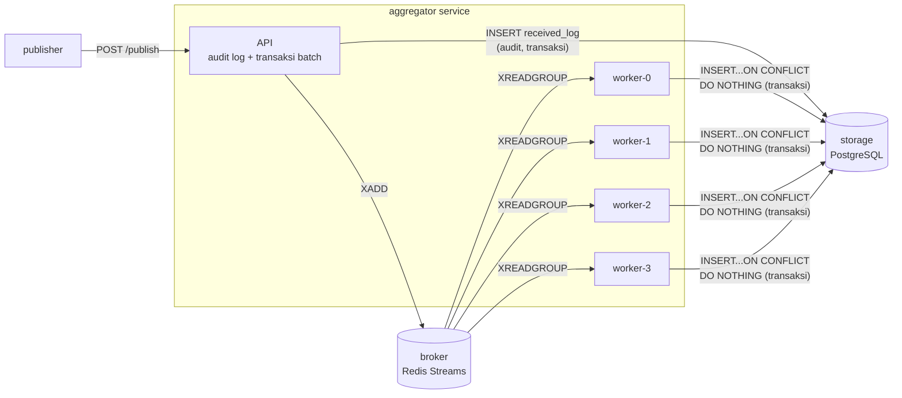

# BAGIAN II — IMPLEMENTASI (70%)
 
## 1. Ringkasan Sistem & Arsitektur
 
Empat layanan berjalan dalam satu jaringan Docker Compose internal:
 

 
Realisasi langsung dari T2 (publish-subscribe untuk decoupling) dan T1 (toleransi terhadap concurrency & independent failure): API path (`/publish`) dan consumer/worker dipisah agar lonjakan publish tidak membanjiri jalur transaksi dedup; Redis Streams + consumer group memberi pembagian beban otomatis antar worker; PostgreSQL sebagai *source of truth* akhir untuk dedup.
 
## 2. Keputusan Desain
 
| Keputusan | Penjelasan singkat | Rujukan teori |
|---|---|---|
| Dedup key `(topic, event_id)` | Namespace per-topik, bukan ID global | T4 |
| At-least-once + idempotent consumer | Lebih murah dari exactly-once | T3 |
| `timestamp` per-event, tanpa total ordering | Tidak ada jam global | T1, T5 |
| Retry + backoff saat XADD gagal | Masking failure | T6 |
| `COUNT(*)` untuk `/stats`, bukan counter manual | Hindari lost-update | T8 |
| `INSERT...ON CONFLICT DO NOTHING` + READ COMMITTED | Idempotent upsert, hindari deadlock locking | T9 |
| Volume `pg_data`, `broker_data` | Persistensi lintas restart | T10 |
| Network `internal`, hanya port 8082(host) terbuka | Isolasi jaringan | T10 |
 
## 3. Hasil Pengujian (17 test)
 
Kategori: validasi skema (5), idempotency/dedup (4), transaksi/konkurensi (3), persistensi (1), observability (3), stress kecil (1).
 
```
collected 17 items
 
test_aggregator.py::test_publish_single_valid_event PASSED                                              [  5%]
test_aggregator.py::test_publish_missing_required_field_rejected PASSED                                 [ 11%]
test_aggregator.py::test_publish_invalid_timestamp_rejected PASSED                                      [ 17%]
test_aggregator.py::test_publish_empty_batch_rejected PASSED                                             [ 23%]
test_aggregator.py::test_publish_batch_with_one_invalid_item_rejects_whole_batch PASSED                  [ 29%]
test_aggregator.py::test_duplicate_event_id_processed_once PASSED                                       [ 35%]
test_aggregator.py::test_same_event_id_different_topic_both_processed PASSED                            [ 41%]
test_aggregator.py::test_duplicate_across_separate_batches PASSED                                       [ 47%]
test_aggregator.py::test_payload_arbitrary_json_round_trips PASSED                                      [ 52%]
test_aggregator.py::test_concurrent_publish_of_same_event_id_no_double_process PASSED                   [ 58%]
test_aggregator.py::test_concurrent_distinct_events_none_lost PASSED                                    [ 64%]
test_aggregator.py::test_stats_consistency_under_load PASSED                                            [ 70%]
test_aggregator.py::test_persistence_after_aggregator_restart PASSED                                    [ 76%]
test_aggregator.py::test_get_stats_shape PASSED                                                         [ 82%]
test_aggregator.py::test_get_events_topic_filter_excludes_other_topics PASSED                           [ 88%]
test_aggregator.py::test_health_endpoint PASSED                                                         [ 94%]
test_aggregator.py::test_small_batch_stress_completes_within_budget PASSED                              [100%]
 
================================ 17 passed in 26.59s ================================
```
 
## 4. Analisis Performa & Metrik
 
Hasil run nyata (`docker compose up --build`, publisher otomatis mengirim beban saat aggregator healthy), diukur setelah reset volume penuh (`docker compose down -v && up -d --build`) agar angka tidak tercampur sisa pengujian lain:
 
| Metrik | Nilai |
|---|---|
| Total event dikirim (`received`) | 20.000 |
| `unique_processed` | 14.000 |
| `duplicate_dropped` | 6.000 |
| Duplicate rate aktual | 6000/20000 = 30,0% |
| Konsistensi (`unique_processed + duplicate_dropped`) | 20.000 = `received` (tidak ada selisih) |
| Throughput pengiriman (publisher → aggregator) | 1.647,4 event/detik (400 batch × 50 event, 0% gagal) |
| Waktu total pengiriman batch | 12,14 detik |
 
**Analisis:** Memenuhi syarat performa minimum soal (≥20.000 event, ≥30% duplikasi, tetap responsif — `/health` tetap `200 OK` selama beban berjalan). Tidak ada event yang hilang maupun ter-double-count: `unique_processed + duplicate_dropped` sama persis dengan `received`, membuktikan dedup atomik bertahan di bawah beban nyata, bukan hanya skenario uji kecil. Catatan: 1.647,4 event/detik adalah throughput sisi *pengiriman* (publisher mengirim 400 batch secara konkuren ke `/publish`, lalu langsung mendapat respons `202`); pemrosesan dedup aktual oleh 4 worker konsumen di belakang `/publish` berjalan asinkron setelahnya — total durasi sampai seluruh backlog terproses lebih lama dari 12,14 detik tersebut, namun tetap konsisten (dibuktikan oleh `/stats` yang sudah tidak berubah lagi saat dicek beberapa saat setelahnya).
 
## 5. Bukti Persistensi
 
Named volumes: `pg_data` (Postgres), `broker_data` (Redis AOF).
 
**Bukti (laporan):** test otomatis `test_persistence_after_aggregator_restart` (lihat §3, output `pytest -v`, status **PASSED**) menjalankan urutan: (1) publish satu event, (2) `docker compose restart aggregator` lewat `subprocess`, (3) tunggu aggregator kembali healthy, (4) kirim ulang `event_id` yang sama, (5) assert tetap hanya 1 baris di `GET /events`. Lolosnya test ini membuktikan dedup store di volume `pg_data` bertahan melewati restart container — bukan hanya datanya yang tetap ada, tapi constraint dedup-nya juga tetap berfungsi setelah container dibuat ulang.
 
**Bukti (video demo):** dilakukan ulang secara manual & live untuk presentasi:
1. `docker compose up -d --build`, publish beberapa event.
2. `docker compose down` (**tanpa** `-v`!) lalu `docker compose up -d`.
3. `GET /events` menunjukkan event yang sama masih ada.
4. Kirim ulang `event_id` yang sama → tetap terdeteksi sebagai duplikat, membuktikan dedup store-nya juga ikut persisten, bukan hanya datanya.
## 6. Observability
 
Logging per-worker (`logger.info`) mencatat setiap event diproses vs. duplikat terdeteksi, termasuk nama worker. `GET /stats` real-time, `GET /health` untuk readiness/liveness (dipakai juga Docker healthcheck).
 
```
aggregator-1  | 2026-06-19 09:59:04,825 INFO aggregator.consumer: worker aggregator-1-worker-1: processed topic=auth event_id=89f268c4-1915-4610-a681-80efbb86e8e8
aggregator-1  | 2026-06-19 09:59:04,827 INFO aggregator.consumer: worker aggregator-1-worker-0: processed topic=orders event_id=c901d9be-2990-4fca-9378-46154d15501b
aggregator-1  | 2026-06-19 09:59:04,831 INFO aggregator.consumer: worker aggregator-1-worker-2: processed topic=payments event_id=f7f0d30e-f112-4bac-ae36-a87420bca649
aggregator-1  | 2026-06-19 09:59:04,839 INFO aggregator.consumer: worker aggregator-1-worker-3: DUPLICATE dropped topic=payments event_id=c6f1552d-1226-4fd1-b24c-eec4ecf77416
aggregator-1  | 2026-06-19 09:59:04,841 INFO aggregator.consumer: worker aggregator-1-worker-1: DUPLICATE dropped topic=payments event_id=2b8f1f46-a186-4fbe-9b31-c85d1a5525f2
aggregator-1  | 2026-06-19 09:59:04,843 INFO aggregator.consumer: worker aggregator-1-worker-0: DUPLICATE dropped topic=orders event_id=e684b25c-de5e-447a-b13e-1e5c17eb5761
aggregator-1  | 2026-06-19 09:59:04,858 INFO aggregator.consumer: worker aggregator-1-worker-1: processed topic=payments event_id=290c3c65-9776-4d49-b603-9953e4d0f4f8
aggregator-1  | 2026-06-19 09:59:04,875 INFO aggregator.consumer: worker aggregator-1-worker-0: processed topic=system event_id=c2868901-4f96-488c-a5ce-4151750df0fc
```
 
Empat worker (`worker-0` s.d. `worker-3`) terlihat memproses event dari topik berbeda secara bersamaan, dengan beberapa di antaranya benar terdeteksi sebagai `DUPLICATE dropped` — bukti pembagian beban antar-worker dan dedup berfungsi bersamaan di bawah konkurensi nyata, sesuai klaim T9.
 
## 7. Keamanan & Jaringan Lokal
 
Seluruh komunikasi antar service terjadi di jaringan Compose internal. Hanya port `8082` (sesuai konfigurasi lokal — lihat README) yang dipublikasikan ke host, semata untuk demo & pengujian lokal. Tidak ada panggilan ke layanan eksternal publik saat runtime.
 
## 8. Keterbatasan & Pengembangan Lanjutan
 
- `XCLAIM`/`XAUTOCLAIM` untuk reclaim pesan pending akibat worker crash belum diimplementasikan.
- Outbox pattern (opsional) belum diimplementasikan secara eksplisit; pendekatan audit log + broker langsung dipakai sebagai gantinya.
- `GET /stats` berbasis `COUNT(*)` dapat melambat pada skala jutaan baris.
- Total ordering tidak didukung; strategi lanjutan: single-partition-per-topic di broker.